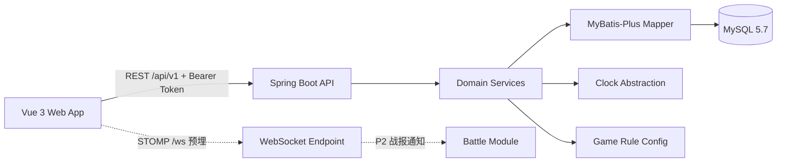

# 虚拟宠物养成项目技术设计

> 文档版本：v2.0  
> 关联文档：`PRD.md`、`AGENTS.md`  
> 当前阶段：单机养成 MVP 技术设计

## 1. 技术栈选择

### 1.1 前端

| 组件 | 选型 | 理由 |
| --- | --- | --- |
| 框架 | Vue 3.5.x | 组合式 API 适合宠物状态、动画和轻交互 |
| 构建 | Vite | 启动和热更新快，适合 vibe coding 小步迭代 |
| 语言 | TypeScript 5.x，开启 strict | 接口和状态枚举可静态校验 |
| 状态 | Pinia | 会话、宠物、UI 三个 store 边界清晰 |
| 路由 | Vue Router 4.x | 领养页和主界面切换 |
| HTTP | Axios 封装 | 统一注入令牌、错误处理和请求 ID |
| 测试 | Vitest + Vue Test Utils | 快速测试 store、组件和格式化逻辑 |
| 样式 | 原生 CSS + CSS 变量 | 像素 UI 可控，避免引入重型 UI 框架 |
| 渲染 | DOM + CSS + PNG 精灵 | MVP 无需 Canvas 引擎，后续可替换渲染组件 |
| 音频 | Web Audio API | 无音频素材，合成 8-bit 提示音 |

不采用 `pet-engine` 或类似未验证依赖。渲染逻辑封装在 `PetStage.vue` 内，未来切换 Canvas、雪碧图或帧动画时不影响游戏状态层。

### 1.2 后端

| 组件 | 选型 | 理由 |
| --- | --- | --- |
| 运行时 | Java 17（本机 `D:\JDK1`） | Spring Boot 3 的最低要求，环境已具备 |
| 框架 | Spring Boot 3.5.x | Web、Validation、Actuator、WebSocket 生态完整 |
| Web | Spring MVC + REST | MVP 主链路足够，易测试 |
| 实时 | Spring WebSocket + STOMP | 只预埋 `/ws` 和主题通道，不进入养成链路 |
| 数据访问 | MyBatis-Plus 3.5.x（`mybatis-plus-spring-boot3-starter`） | SQL 可控，CRUD 高效 |
| 数据库迁移 | Liquibase formatted SQL | 对 MySQL 5.7 兼容稳定 |
| 数据库 | 本机 MySQL 5.7.44；生产目标 MySQL 8 | 复用现有服务，避免额外安装 |
| 参数校验 | Jakarta Validation | 名字、操作、时间推进等输入校验 |
| 测试 | JUnit 5、MockMvc、H2 MySQL 模式 | 不依赖 Docker，测试可本地运行 |
| 构建 | Maven 3.8.1 + Java 17 | 本机已有 Maven |

### 1.3 开发与 AI 工具

| 工具 | 配置 |
| --- | --- |
| Claude Code | 2.1.220，已安装 |
| DeepSeek Anthropic 兼容地址 | `https://api.deepseek.com/anthropic` |
| 默认模型 | `deepseek-flash`（已通过模型列表验证；不要使用 `deepseek-v4-flash`） |
| 主/子代理模型 | 全部 `deepseek-flash` |
| 长上下文 | 默认不使用未验证的 `[1M]` 后缀；需要时先单独验证 `deepseek-flash[1M]` |
| 密钥 | 只放在系统环境变量 `ANTHROPIC_AUTH_TOKEN`，不进入仓库 |
| npm 源 | 项目内 `.npmrc` 使用 `https://registry.npmmirror.com` 或官方 HTTPS 源 |

Claude Code 全 Flash 模型执行策略：

- 每批只允许一个功能切片，建议改动不超过 5 个文件。
- 每批先阅读现有代码和相关测试，再实现，不跨模块顺手重构。
- 每批结束必须运行对应测试或构建命令。
- 复杂需求先写测试，再实现，避免 Flash 模型一次性生成大块代码。
- 超过 300 行的新文件必须拆分或说明原因。

## 2. 总体架构



架构约束：

- REST 是 MVP 唯一业务主链路。
- WebSocket 只做连通性和未来通知，不参与状态结算、操作和进化。
- 所有游戏规则集中在后端领域服务，前端不得自行计算衰减或经验。
- 数据库只保存状态、配置快照和操作日志，不保存逐小时时间序列。
- 服务端时间通过可注入的 `Clock` 获取，测试使用固定时钟。

## 3. 项目结构

```text
D:\code\virtual pet\
├── AGENTS.md
├── PRD.md
├── TECH_DESIGN.md
├── README.md
├── CLAUDE.md
├── 设计方案.md
├── docs\
│   ├── api.md
│   └── balance.md
├── scripts\
│   ├── dev.ps1
│   ├── generate_sprites.py
│   └── maven-settings.xml          # 可选，仅网络需要时使用
├── pet-server\
│   ├── pom.xml
│   └── src\
│       ├── main\
│       │   ├── java\com\virtualpet\
│       │   │   ├── VirtualPetApplication.java
│       │   │   ├── common\
│       │   │   │   ├── ApiResponse.java
│       │   │   │   ├── ErrorCode.java
│       │   │   │   └── GlobalExceptionHandler.java
│       │   │   ├── config\
│       │   │   │   ├── ClockConfig.java
│       │   │   │   ├── WebConfig.java
│       │   │   │   └── WebSocketConfig.java
│       │   │   ├── auth\
│       │   │   │   ├── AuthInterceptor.java
│       │   │   │   ├── PlayerContext.java
│       │   │   │   └── TokenService.java
│       │   │   ├── player\
│       │   │   │   ├── PlayerController.java
│       │   │   │   ├── PlayerService.java
│       │   │   │   ├── PlayerMapper.java
│       │   │   │   └── Player.java
│       │   │   ├── pet\
│       │   │   │   ├── PetController.java
│       │   │   │   ├── PetService.java
│       │   │   │   ├── PetSettlementService.java
│       │   │   │   ├── PetActionService.java
│       │   │   │   ├── EvolutionService.java
│       │   │   │   ├── PetMapper.java
│       │   │   │   ├── PetActionLogMapper.java
│       │   │   │   ├── Pet.java
│       │   │   │   └── PetActionLog.java
│       │   │   ├── game\
│       │   │   │   ├── GameConfigController.java
│       │   │   │   ├── GameRules.java
│       │   │   │   ├── Species.java
│       │   │   │   ├── PetAction.java
│       │   │   │   ├── PetStatus.java
│       │   │   │   └── EvolutionStage.java
│       │   │   ├── dev\
│       │   │   │   └── DevTimeController.java
│       │   │   └── battle\              # P1，占位
│       │   └── resources\
│       │       ├── application.yml
│       │       ├── application-dev.yml
│       │       ├── application-local.yml.example
│       │       └── db\changelog\
│       │           ├── db.changelog-master.yaml
│       │           └── 001-init.sql
│       └── test\java\com\virtualpet\
│           ├── pet\PetSettlementServiceTest.java
│           ├── pet\PetActionServiceTest.java
│           ├── pet\EvolutionServiceTest.java
│           └── api\PetApiIntegrationTest.java
└── pet-web\
    ├── .npmrc
    ├── package.json
    ├── vite.config.ts
    ├── tsconfig.json
    ├── index.html
    └── src\
        ├── main.ts
        ├── App.vue
        ├── api\
        │   ├── client.ts
        │   ├── session.ts
        │   ├── pet.ts
        │   └── gameConfig.ts
        ├── assets\
        │   ├── pets\
        │   │   ├── cat-stage-0.png
        │   │   ├── cat-stage-1.png
        │   │   ├── cat-stage-2.png
        │   │   ├── dog-stage-0.png
        │   │   ├── dog-stage-1.png
        │   │   ├── dog-stage-2.png
        │   │   ├── dragon-stage-0.png
        │   │   ├── dragon-stage-1.png
        │   │   └── dragon-stage-2.png
        │   └── contact-sheet.png
        ├── components\
        │   ├── PetStage.vue
        │   ├── StatusPanel.vue
        │   ├── ActionDock.vue
        │   ├── SpeechBubble.vue
        │   ├── JournalPanel.vue
        │   ├── PixelButton.vue
        │   └── SettingsModal.vue
        ├── composables\
        │   ├── useAudio.ts
        │   └── useIdleSpeech.ts
        ├── content\
        │   └── petLines.ts
        ├── stores\
        │   ├── sessionStore.ts
        │   ├── petStore.ts
        │   └── uiStore.ts
        ├── views\
        │   ├── OnboardingView.vue
        │   └── HomeView.vue
        └── styles\
            ├── theme.css
            └── pixel.css
```

## 4. 数据模型

### 4.1 枚举

```text
Species: CAT | DOG | DRAGON
Action: FEED | PLAY | CLEAN | SLEEP | WAKE
PetStatus: NORMAL | HUNGRY | DIRTY | TIRED | SAD | SICK | SLEEPING
EvolutionStage: 0 | 1 | 2
```

### 4.2 players

| 字段 | 类型 | 约束 | 说明 |
| --- | --- | --- | --- |
| id | BIGINT | PK, AUTO_INCREMENT | 玩家 ID |
| device_id | VARCHAR(64) | UNIQUE, NOT NULL | 浏览器生成的随机设备 ID |
| token_hash | VARCHAR(128) | NOT NULL | 访问令牌的 SHA-256 哈希 |
| friend_code | VARCHAR(12) | UNIQUE, NULL | P1 好友码 |
| created_at | TIMESTAMP | NOT NULL | UTC 创建时间 |
| last_seen_at | TIMESTAMP | NOT NULL | UTC 最近访问时间 |

### 4.3 pets

| 字段 | 类型 | 约束 | 说明 |
| --- | --- | --- | --- |
| id | BIGINT | PK, AUTO_INCREMENT | 宠物 ID |
| player_id | BIGINT | UNIQUE, NOT NULL, FK | 一名玩家一只宠物 |
| species | VARCHAR(16) | NOT NULL | CAT/DOG/DRAGON |
| name | VARCHAR(32) | NOT NULL | 1–8 个字符 |
| satiety | INT | NOT NULL, 0–100 | 饱食 |
| mood | INT | NOT NULL, 0–100 | 心情 |
| hygiene | INT | NOT NULL, 0–100 | 清洁 |
| energy | INT | NOT NULL, 0–100 | 精力 |
| health | INT | NOT NULL, 0–100 | 健康 |
| sick | TINYINT | NOT NULL, DEFAULT 0 | 生病滞回标志：健康 <30 置位，≥50 清除 |
| status | VARCHAR(16) | NOT NULL | 当前状态枚举 |
| level | INT | NOT NULL, 1–10 | 等级 |
| exp | INT | NOT NULL, >=0 | 当前累计经验 |
| evolution_stage | INT | NOT NULL, 0–2 | 进化阶段 |
| sleeping_since | TIMESTAMP | NULL | UTC 入睡时间 |
| last_settled_at | TIMESTAMP | NOT NULL | 上次结算时间 |
| version | INT | NOT NULL, DEFAULT 0 | 乐观锁 |
| created_at | TIMESTAMP | NOT NULL | UTC 创建时间 |
| updated_at | TIMESTAMP | NOT NULL | UTC 更新时间 |

索引：

- `UNIQUE(player_id)`
- `INDEX(last_settled_at)`
- `INDEX(status)`

### 4.4 pet_action_logs

| 字段 | 类型 | 约束 | 说明 |
| --- | --- | --- | --- |
| id | BIGINT | PK, AUTO_INCREMENT | 日志 ID |
| pet_id | BIGINT | NOT NULL, FK | 宠物 ID |
| action | VARCHAR(16) | NOT NULL | FEED/PLAY/CLEAN/SLEEP/WAKE |
| client_request_id | VARCHAR(64) | UNIQUE, NOT NULL | 幂等键 |
| result_json | TEXT | NOT NULL | 操作结果摘要 |
| created_at | TIMESTAMP | NOT NULL | UTC 创建时间 |

### 4.5 battles（P1）

预留字段：`id`、`challenger_pet_id`、`defender_pet_id`、`challenger_snapshot`、`defender_snapshot`、`seed`、`result_json`、`status`、`created_at`、`finished_at`。MVP 不创建该表。

## 5. API 设计

所有接口统一前缀 `/api/v1`，统一响应结构：

```json
{
  "code": "OK",
  "message": "success",
  "data": {},
  "serverTime": "2026-09-17T12:00:00Z"
}
```

### 5.1 匿名会话

```http
POST /api/v1/session
Content-Type: application/json

{
  "deviceId": "8f6f2d0e-..."
}
```

返回：

```json
{
  "playerId": 1,
  "token": "一次性返回的随机令牌",
  "pet": null
}
```

### 5.2 创建宠物

```http
POST /api/v1/pets
Authorization: Bearer <token>

{
  "species": "CAT",
  "name": "咪咪"
}
```

规则：

- 每名玩家只能创建一次。
- 已存在宠物返回 HTTP 409。
- 名字去除首尾空格，长度 1–8。

### 5.3 查询宠物

```http
GET /api/v1/pets/me
Authorization: Bearer <token>
```

返回结算后的宠物完整状态，包括属性、状态、等级、经验、进化阶段、睡觉时间和冷却信息。

### 5.4 执行操作

```http
POST /api/v1/pets/me/actions
Authorization: Bearer <token>

{
  "action": "FEED",
  "clientRequestId": "a7c1b2..."
}
```

返回：

```json
{
  "pet": {},
  "deltas": {
    "satiety": 30,
    "mood": 3,
    "hygiene": -2,
    "energy": 0,
    "health": 0
  },
  "xpGained": 6,
  "levelUp": false,
  "evolved": false,
  "messageKey": "FEED_OK",
  "cooldownUntil": "2026-09-17T12:01:00Z"
}
```

错误码：

| HTTP | code | 场景 |
| ---: | --- | --- |
| 400 | INVALID_ACTION | 操作枚举非法 |
| 400 | INVALID_NAME | 名字非法 |
| 401 | UNAUTHORIZED | 令牌缺失或无效 |
| 404 | PET_NOT_FOUND | 尚未创建宠物 |
| 409 | PET_ALREADY_EXISTS | 重复创建宠物 |
| 429 | ACTION_COOLDOWN | 操作冷却中 |
| 409 | ACTION_NO_EFFECT | 当前操作无效果 |

### 5.5 游戏配置

```http
GET /api/v1/game/config
```

返回物种、操作效果、冷却、等级阈值和进化条件。前端只缓存，不把它们写入业务判断。

### 5.6 重置存档

```http
DELETE /api/v1/pets/me
Authorization: Bearer <token>
```

删除当前玩家关联的宠物和日志，玩家记录保留，便于重新领养。前端必须二次确认。

### 5.7 开发时间推进

```http
POST /api/v1/dev/advance-time
Authorization: Bearer <token>

{
  "hours": 12
}
```

仅在 `dev` profile 启用。用于验证离线衰减、生病、睡觉和进化。生产环境必须禁用。

### 5.8 开发状态铺设

```http
POST /api/v1/dev/set-state
Authorization: Bearer <token>

{
  "exp": 490,
  "satiety": 100
}
```

同样只在 `dev` profile 启用。每个字段都可以不传，不传就保持原值。

存在的理由和 5.7 一样，是"真实等待无法验收"：升到 8 级要 490 经验，而每次照护只有
6–8 点、还带 60 秒冷却，`PRD.md` 2.7 给正常节奏的估计是"第 16 天到 8 级"；
健康恢复也要求四项属性连续多小时高于 60。没有铺设工具，这两条验收路径就只能靠
几十分钟的真实操作，等于没法回归。

铺设完会立刻走一遍真实的后处理（重算状态、重算等级与进化），所以规则一条都没绕过 ——
接口换掉的只是"属性/经验是从哪来的"。

### 5.9 WebSocket 预埋

```text
Endpoint: /ws
Application prefix: /app
Broker prefix: /topic
Ping: /app/ping -> /topic/ping
P1 battle topic: /topic/battles/{battleId}
```

MVP 只实现配置、连通性测试和 ping；不实现房间、在线状态和战斗广播。单实例使用内存 broker，若未来多实例部署再引入 Redis relay。

## 6. 核心算法

### 6.1 懒结算

`settlePet(pet, now)` 的伪代码：

```text
if sleeping:
    elapsed = min(now - sleepingSince, 12h)
    applySleepDecay(elapsed)
    if energy >= 95 or elapsed >= 10h:
        wakeUp()
else:
    elapsed = min(now - lastSettledAt, 12h)
    applyAwakeDecay(elapsed)

applyHealthChange(elapsed)
updateStatus()
checkEvolution()
// 只推进"整小时"那一段，不足一小时的余数留给下次，不要直接写 now
lastSettledAt = cursor + settledHours
```

实现要求：

- `elapsed` 以分钟或秒为单位统一计算，最后按整数比例应用。
- **结算只按整小时，游标只推进整小时。** 伪代码最后一行如果想要写成
  `lastSettledAt = now`，会让频繁刷新页面的玩家每次都被结算一次，
  而属性是整数、按小时衰减，不足一小时的衰减会被抹掉 ——
  结果就是天天开着的玩家属性永远不会下降。正确做法是保留余数，
  只有封顶 12 小时时才把游标直接推到 `now`（丢弃超出的部分）。
- 单次结算最多 12 小时；超过部分直接丢弃，不累计。
- 所有服务端读取和写入路径都必须先结算。
- 不在每次结算中写逐小时日志，只保存最终状态。
- 使用 `Clock` 注入，测试不能调用 `Instant.now()`。
  注入的时钟**精度是整秒**（见 `ClockConfig`）：`pets` 的时间列是秒精度的
  `TIMESTAMP`，而 MySQL 会把小数秒四舍五入，算得比存得精细就会凭空多出或少掉
  最多半秒，正好卡在小时边界上时会让整次结算少算一小时。

### 6.2 操作处理

```text
begin transaction
  settle pet
  find action log by clientRequestId
  if exists: return saved result
  validate action and cooldown
  apply species modifiers
  clamp stats to 0..100
  calculate xp, level, evolution
  save pet with optimistic lock
  save action log with result
commit
return result
```

并发冲突最多重试 2 次；重复请求必须返回已保存的结果，而不是再次执行。

### 6.3 属性与状态优先级

结算后的状态判定优先级：

1. `SLEEPING`
2. `SICK`（见下方滞回说明，不是单纯比 health < 30）
3. `HUNGRY`（satiety < 25）
4. `TIRED`（energy < 20）
5. `DIRTY`（hygiene < 25）
6. `SAD`（mood < 30）
7. `NORMAL`

多项异常同时存在时显示最高优先级状态，但前端状态条仍展示全部异常属性。

**生病是滞回状态，不是纯阈值。** `PRD.md` 2.3 写的是"健康低于 30 进入生病状态，
恢复到 50 以上解除"，所以判定要带上"之前是不是已经病了"这个输入：

| 之前 | 健康 | 结果 |
| --- | --- | --- |
| 健康 | < 30 | 进入生病 |
| 健康 | ≥ 30 | 正常 |
| 生病 | < 50 | 保持生病 |
| 生病 | ≥ 50 | 解除生病 |

也就是说 30–49 这一段是"维持原状"的缓冲区。`pets.sick` 列持久化这个标志，
光看 `health` 是推不出来的。

### 6.4 等级和进化

- 经验为累计值，等级由阈值表决定。
- 每次操作后重新计算等级，升级可连续触发。
- 进化条件：
  - 阶段 1：level ≥ 4 且 health ≥ 60。
  - 阶段 2：level ≥ 8 且 health ≥ 70，且 satiety、mood、hygiene、energy 全部 ≥50。
- 进化检查只升不降。
- 进化结果通过 `evolved` 字段返回，前端播放对应动画。

### 6.5 时间与时钟

- 数据库统一存 UTC。
- 前端展示时转换为本地时区。
- API 响应带 `serverTime`，客户端不自行推断服务器时间。
- 本地开发时区为 `Asia/Shanghai`，但代码不得依赖服务器本地时区。

### 6.6 匿名令牌

```text
token = secureRandom(32 bytes) -> URL-safe string
token_hash = SHA-256(token)
```

- 原始令牌只在创建会话时返回一次。
- 后续请求通过 `Authorization: Bearer <token>` 传递。
- 服务端比对哈希，不存储明文。
- 连续无效令牌返回 401，不泄露设备是否存在。

### 6.7 请求访问日志

对应 `PRD.md` 6.6。每个请求记录 **requestId、路径、耗时和结果码**：

```text
18:25:03.421 INFO  [7f3a1c9e-...] RequestLoggingFilter - POST /api/v1/pets/me/actions -> 200 OK (37ms)
```

- requestId 优先取调用方传来的 `X-Request-Id`（会做字符清洗和截断），
  没有就自己生成，两种情况都回写到响应头，方便报障时对齐。
- requestId 同时放进 MDC，同一次请求里打的业务日志都会带上它，
  排查时能把一条链串起来。
- 结果码取响应信封里的业务码（`OK` / `PET_NOT_FOUND` …）；
  没有信封的请求（静态资源、actuator）退回 `HTTP_<状态码>`。
- 封装在 `RequestLoggingFilter` 里，顺序设为最高，这样鉴权失败的 401
  也会被计时和记录。

## 7. 前端架构

### 7.1 Store 边界

| Store | 责任 |
| --- | --- |
| sessionStore | deviceId、token、玩家 ID、会话初始化 |
| petStore | 宠物状态、操作请求、冷却、日志、进化状态 |
| uiStore | 音效开关、弹窗、动画状态、响应式 UI 状态 |

规则：

- 组件不直接调用 Axios，统一通过 API 模块和 store。
- 服务端返回的状态是最终事实；本地乐观更新只用于即时动画。
- 操作失败时回滚乐观状态并展示错误原因。

### 7.2 组件职责

- `OnboardingView`：物种卡片、名字输入、创建宠物。
- `HomeView`：组合状态区、舞台、操作区和日志区。
- `PetStage`：根据物种、阶段、状态选择精灵并播放 CSS 反馈。
- `StatusPanel`：五项状态条和文字提示。
- `ActionDock`：四个操作按钮、冷却和禁用原因。
- `SpeechBubble`：展示当前台词。
- `JournalPanel`：展示最近操作和离线摘要。
- `SettingsModal`：音效开关、重新领养、版本信息。

### 7.3 前端状态流

```text
用户点击操作
  -> 按钮立即进入按压/冷却动画
  -> 生成 clientRequestId
  -> 调用 action API
  -> 成功：用服务端 pet 覆盖 store，播放音效和台词
  -> 失败：回滚动画，展示后端原因
```

### 7.4 路由

- `/`：有宠物进入 `HomeView`，无宠物进入 `OnboardingView`。
- `/onboarding`：强制领养流程。
- 不实现复杂嵌套路由，MVP 只保留两个主视图和一个设置弹窗。

## 8. 美术与音频实现

### 8.1 精灵图生成

`scripts/generate_sprites.py` 要求：

- 使用 Python 3.10 和 Pillow 10.3。
- 输出 9 张 64×64 RGBA PNG。
- 使用 16–24 色统一调色板。
- 使用最近邻缩放，禁止抗锯齿。
- 生成 `contact-sheet.png` 用于一致性检查。
- 固定随机种子，脚本重复执行结果一致。
- 生成文件直接写入 `pet-web/src/assets/pets/`。

三只宠物的轮廓区分：

- 猫：尖耳、胡须、尾巴。
- 狗：垂耳、圆口鼻、尾巴。
- 龙：角、翅膀、尖尾。

三个阶段的变化：

- 阶段 0：体型小，颜色偏浅，无配饰。
- 阶段 1：体型中等，增加围巾或花纹。
- 阶段 2：体型最大，增加发光轮廓或专属装饰。

### 8.2 音频

- `useAudio.ts` 封装 AudioContext。
- 首次用户点击后初始化 AudioContext。
- 使用短促方波、三角波和噪声模拟 8-bit 音效。
- 每个音效时长控制在 80–250ms。
- 静音开关保存在 `localStorage`。
- AudioContext 失败时静默降级，不影响操作。

## 9. 关键技术点与风险

| 技术点 | 风险 | 处理方案 |
| --- | --- | --- |
| Java 版本 | 默认 Java 8 无法运行 Spring Boot 3 | 所有构建命令显式设置 `JAVA_HOME=D:\JDK1` |
| MySQL 版本 | 本机是 5.7，方案原写 8.0 | 本地用 5.7，SQL 保持兼容，部署再迁移 |
| 离线结算 | 直接循环小时会慢且难测试 | 使用 O(1) 时间差结算，单次封顶 12 小时 |
| 重复点击 | 可能重复加经验或扣属性 | `clientRequestId` 唯一索引 + 事务内幂等返回 |
| 并发更新 | 同一宠物可能被两个请求同时修改 | 乐观锁 `version` + 有限重试 |
| 时间测试 | 真实等待无法验收 | 注入 `Clock`，dev profile 提供时间推进接口 |
| 时区 | 服务器和浏览器时区不同 | 数据库 UTC，响应带 `serverTime` |
| Flash 模型能力 | 复杂重构容易产生不一致代码 | 小批次、单功能、先测试、每批构建 |
| 模型 ID | 错误 ID 会导致 Claude Code 失败 | 使用已验证的 `deepseek-flash`，不默认加 `[1M]` |
| npm 源 | 旧淘宝源不可用 | 项目内 `.npmrc` 使用 HTTPS 镜像 |
| WebSocket 过度设计 | 增加调试成本但没有 MVP 价值 | 只保留配置和 ping，不进入养成链路 |
| 程序化像素图 | 可能显得简单或轮廓不清晰 | 先生成 contact sheet，统一调色板和轮廓，再调参数 |
| 中文像素字体 | 字库授权和字形覆盖不确定 | 只使用确认授权的字体，否则回退系统字体 |
| 音效自动播放 | 浏览器阻止自动播放 | 首次点击后再初始化 AudioContext |
| 清除本地存储 | 匿名存档无法恢复 | MVP 明示风险，P2 提供账号绑定 |

## 10. 测试策略

### 10.1 后端测试

- `PetSettlementServiceTest`：0 秒、1 小时、8 小时、12 小时、超过 12 小时、睡觉、自动醒来。
- `PetActionServiceTest`：四种操作、冷却、无效果、物种修正、重复请求幂等。
- `EvolutionServiceTest`：等级边界、健康边界、四项状态边界、连续进化。
- `PetApiIntegrationTest`：匿名会话、创建宠物、查询、操作、重置、错误码。
- `WebSocketConfigTest`：连接和 ping 通道。
- `MySQLSmokeTest`：至少一次使用本机 MySQL 5.7 跑迁移和接口冒烟。

### 10.2 前端测试

- `sessionStore`：首次初始化、已有令牌、401 处理。
- `petStore`：操作成功、失败回滚、冷却、日志。
- `OnboardingView`：三只宠物展示、名字校验、创建成功。
- `HomeView`：状态渲染、按钮禁用、进化提示。
- `petLines`：同一状态不连续重复。
- 构建：`npm run build` 必须通过。

### 10.3 人工验收

- 360px、768px、1440px 三档截图检查。
- 三种宠物各完成一次领养和四类操作。
- 使用 dev 时间推进模拟 8 小时、12 小时、24 小时。
- 验证生病、恢复、两次进化和重新领养。
- 检查音效开关、刷新存档、前后端重启后存档。

### 10.4 标准命令

```powershell
$env:JAVA_HOME = 'D:\JDK1'
mvn -f pet-server/pom.xml test

npm --prefix pet-web install
npm --prefix pet-web run test
npm --prefix pet-web run build
```

## 11. 本地配置与启动

### 11.1 数据库准备

需要创建：

- 数据库：`virtual_pet`，字符集 `utf8mb4`。
- 开发账号：`pet_app`，只授予 `virtual_pet` 的读写权限。
- 测试数据库：`virtual_pet_test`，仅用于 MySQL 冒烟测试。

数据库密码不提交到仓库：

- 示例文件：`application-local.yml.example`。
- 本地文件：`application-local.yml`，加入 `.gitignore`。

### 11.2 启动顺序

1. 确认 MySQL 5.7 服务运行在 3306。
2. 启动后端：`mvn -f pet-server/pom.xml spring-boot:run`。
3. 启动前端：`npm --prefix pet-web run dev`。
4. 打开 Vite 地址，通过代理访问 `/api`。

`scripts/dev.ps1` 后续负责同时启动前后端，并先设置 Java 17 环境变量。

### 11.3 配置项

```yaml
spring:
  datasource:
    url: jdbc:mysql://localhost:3306/virtual_pet?useUnicode=true&characterEncoding=utf8&serverTimezone=UTC
    username: pet_app
    password: ${PET_DB_PASSWORD}
  liquibase:
    enabled: true

app:
  game:
    offline-cap-hours: 12
    pace-multiplier: 1
  token:
    ttl-days: 365
```

`app.game.pace-multiplier` 只用于时间和测试调优，生产默认必须为 1。

## 12. 部署与演进

### 12.1 MVP

- 仅本机运行。
- 前端 Vite dev server，后端 Spring Boot，数据库 MySQL 5.7。
- 不配置公网域名、HTTPS、Redis 和云数据库。

### 12.2 P1 异步对战

- 增加好友码、宠物快照、战斗记录和战报页面。
- 战斗计算在服务端完成，固定种子保证可复现。
- 使用 WebSocket 通知战报就绪。
- 单实例部署可继续使用内存 broker。

### 12.3 P2 公网与实时对战

- 后端容器化或部署到云服务器。
- MySQL 升级到 8.0，开启备份。
- HTTPS/WSS、反向代理、跨域白名单和速率限制。
- 多实例时引入 Redis 和 STOMP relay。
- 增加账号绑定、监控、告警和日志聚合。

## 13. 已冻结的技术决策

- 单宠物槽，不做多宠物。
- 懒结算，不做每分钟定时衰减。
- REST 为 MVP 主链路。
- WebSocket 仅预埋。
- 不使用 Redis。
- 不使用未验证的 `pet-engine`。
- 不使用运行时 LLM。
- 不引入 Canvas 引擎，先使用 DOM/CSS 渲染。
- 精灵图由脚本程序化生成，不使用当前环境不可用的图像生成工具。
- 数值、接口和枚举以后端实现为准，前端不得复制规则。
